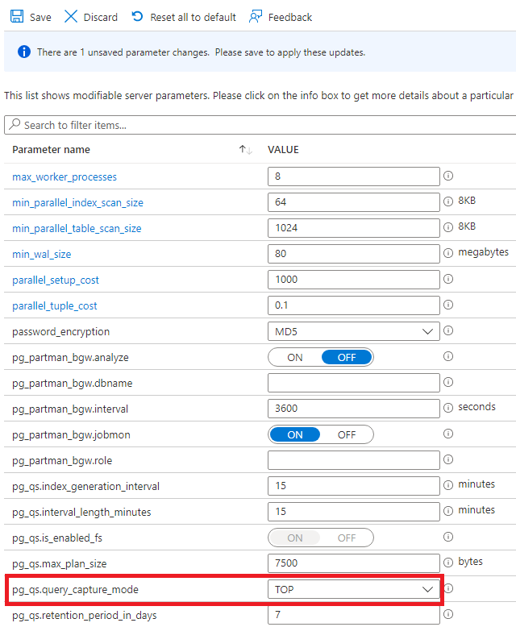

---
lab:
  title: クエリ ストアを使用してクエリ パフォーマンスを評価する
  module: Tune queries in Azure Database for PostgreSQL
---

# クエリ ストアを使用してクエリ パフォーマンスを評価する

この演習では、Azure Database for PostgreSQL のクエリ ストアを使用してパフォーマンス メトリックのクエリを実行する方法について学びます。

## 開始する前に

このモジュールの演習を完了するには、自分の Azure サブスクリプションが必要です。 Azure サブスクリプションをお持ちでない場合は、「[Azure の無料アカウントを使ってクラウドで構築](https://azure.microsoft.com/free/)」で無料試用版のアカウントを設定できます。

## 演習環境を作成する

### Azure サブスクリプションにリソースをデプロイする

この手順では、Azure Cloud Shell の Azure CLI コマンドにより、リソース グループを作成し、Bicep スクリプトを実行して、この演習を完了するのに必要な Azure サービスを Azure サブスクリプションにデプロイします。

1. Web ブラウザーを開いて [Azure portal](https://portal.azure.com/) に移動します。

2. Azure portal ツール バーの **[Cloud Shell]** アイコンを選択して、ブラウザー画面の下部に新しい [Cloud Shell](https://learn.microsoft.com/azure/cloud-shell/overview) 画面を開きます。

    ![[Cloud Shell] アイコンが赤の四角で強調表示された Azure portal のスクリーンショット。](media/09-portal-toolbar-cloud-shell.png)

    メッセージが表示されたら、必要なオプションを選択して *Bash* シェルを開きます。 以前に *PowerShell* コンソールを使用している場合は、*Bash* シェルに切り替えます。

3. Cloud Shell プロンプトで、次のように入力して、演習リソースを含む GitHub リポジトリを複製します。

    ```bash
    git clone https://github.com/MicrosoftLearning/mslearn-postgresql.git
    ```

4. 次に、Azure CLI コマンドを使用して Azure リソースを作成するときに、冗長な型指定を減らすための変数を定義する 3 つのコマンドを実行します。 この変数は、リソース グループに割り当てる名前 (`RG_NAME`)、リソースがデプロイされる Azure リージョン (`REGION`)、PostgreSQL 管理者ログイン用にランダムに生成されたパスワード (`ADMIN_PASSWORD`) を表します。

    最初のコマンドで、対応する変数に割り当てられるリージョンは `eastus` ですが、任意の場所に置き換えることもできます。

    ```bash
    REGION=eastus
    ```

    次のコマンドで、この演習で使用されるすべてのリソースを格納するリソース グループに使用する名前が割り当てられます。 対応する変数に割り当てられたリソース グループ名は `rg-learn-work-with-postgresql-$REGION` で、その中の `$REGION` は上で指定した場所です。 ただし、この部分は好みに合わせて他のリソース グループ名に変更できます。

    ```bash
    RG_NAME=rg-learn-work-with-postgresql-$REGION
    ```

    最後のコマンドでは、PostgreSQL 管理者ログイン用のパスワードがランダムに生成されます。 後で PostgreSQL フレキシブル サーバーに接続するのに使用できるように、このパスワードを必ず安全な場所にコピーしてください。

    ```bash
    a=()
    for i in {a..z} {A..Z} {0..9}; 
       do
       a[$RANDOM]=$i
    done
    ADMIN_PASSWORD=$(IFS=; echo "${a[*]::18}")
    echo "Your randomly generated PostgreSQL admin user's password is:"
    echo $ADMIN_PASSWORD
    ```

5. 複数の Azure サブスクリプションにアクセスでき、既定のサブスクリプションがこの演習でリソース グループとその他のリソースを作成するものでない場合は、次のコマンドを実行して適切なサブスクリプションを設定し、`<subscriptionName|subscriptionId>` トークンを使用するサブスクリプションの名前または ID に置き換えます。

    ```azurecli
    az account set --subscription <subscriptionName|subscriptionId>
    ```

6. 次の Azure CLI コマンドを実行して、リソース グループを作成します。

    ```azurecli
    az group create --name $RG_NAME --location $REGION
    ```

7. 最後に、Azure CLI を使用して Bicep デプロイ スクリプトを実行し、リソース グループ内の Azure リソースをプロビジョニングします。

    ```azurecli
    az deployment group create --resource-group $RG_NAME --template-file "mslearn-postgresql/Allfiles/Labs/Shared/deploy-postgresql-server.bicep" --parameters adminLogin=pgAdmin adminLoginPassword=$ADMIN_PASSWORD databaseName=adventureworks
    ```

    Bicep デプロイ スクリプトでは、この演習を完了するのに必要な Azure サービスがリソース グループにプロビジョニングされます。 デプロイされるリソースは、Azure Database for PostgreSQL - フレキシブル サーバーです。 bicep スクリプトではデータベースも作成されます。このデータベースは、コマンド ラインでパラメーターとして構成できます。

    デプロイが完了するまでに通常数分かかります。 Cloud Shell から監視するか、上で作成したリソース グループの **[デプロイ]** ページに移動し、そこでデプロイの進行状況を確認することができます。

8. リソースのデプロイが完了したら、Cloud Shell 画面を閉じます。

### デプロイ エラーのトラブルシューティング

Bicep デプロイ スクリプトを実行すると、いくつかエラーが発生する場合があります。 最も一般的なメッセージとその解決手順は次のとおりです。

- 以前にこのラーニング パスで Bicep デプロイ スクリプトを実行してその後リソースを削除した場合、リソースを削除してから 48 時間以内にスクリプトをまた実行しようとすると、次のようなエラー メッセージが表示される場合があります。

    ```bash
    {"code": "InvalidTemplateDeployment", "message": "The template deployment 'deploy' is not valid according to the validation procedure. The tracking id is '4e87a33d-a0ac-4aec-88d8-177b04c1d752'. See inner errors for details."}
    
    Inner Errors:
    {"code": "FlagMustBeSetForRestore", "message": "An existing resource with ID '/subscriptions/{subscriptionId}/resourceGroups/rg-learn-postgresql-ai-eastus/providers/Microsoft.CognitiveServices/accounts/{accountName}' has been soft-deleted. To restore the resource, you must specify 'restore' to be 'true' in the property. If you don't want to restore existing resource, please purge it first."}
    ```

    このメッセージが表示された場合は、`restore` パラメーターが `true` に設定されるように上記の `azure deployment group create` コマンドを変更し、再実行します。

- 選択したリージョンで特定のリソースのプロビジョニングが制限されている場合は、`REGION` 変数を別の場所に設定してコマンドを再実行し、リソース グループを作成して、Bicep デプロイ スクリプトを実行する必要があります。

    ```bash
    {"status":"Failed","error":{"code":"DeploymentFailed","target":"/subscriptions/{subscriptionId}/resourceGroups/{resourceGrouName}/providers/Microsoft.Resources/deployments/{deploymentName}","message":"At least one resource deployment operation failed. Please list deployment operations for details. Please see https://aka.ms/arm-deployment-operations for usage details.","details":[{"code":"ResourceDeploymentFailure","target":"/subscriptions/{subscriptionId}/resourceGroups/{resourceGroupName}/providers/Microsoft.DBforPostgreSQL/flexibleServers/{serverName}","message":"The resource write operation failed to complete successfully, because it reached terminal provisioning state 'Failed'.","details":[{"code":"RegionIsOfferRestricted","message":"Subscriptions are restricted from provisioning in this region. Please choose a different region. For exceptions to this rule please open a support request with Issue type of 'Service and subscription limits'. See https://review.learn.microsoft.com/en-us/azure/postgresql/flexible-server/how-to-request-quota-increase for more details."}]}]}}
    ```

- 責任ある AI 契約に同意する必要があるためにスクリプトで AI リソースを作成できない場合は、次のエラーが発生する場合があります。その場合は、Azure portal ユーザー インターフェイスを使用して Azure AI サービス リソースを作成し、デプロイ スクリプトを再実行します。

    ```bash
    {"code": "InvalidTemplateDeployment", "message": "The template deployment 'deploy' is not valid according to the validation procedure. The tracking id is 'f8412edb-6386-4192-a22f-43557a51ea5f'. See inner errors for details."}
     
    Inner Errors:
    {"code": "ResourceKindRequireAcceptTerms", "message": "This subscription cannot create TextAnalytics until you agree to Responsible AI terms for this resource. You can agree to Responsible AI terms by creating a resource through the Azure Portal then trying again. For more detail go to https://go.microsoft.com/fwlink/?linkid=2164190"}
    ```

## Azure Cloud Shell で psql を使用してデータベースに接続する

このタスクでは、[Azure Cloud Shell](https://learn.microsoft.com/azure/cloud-shell/overview) の [psql コマンドライン ユーティリティ](https://www.postgresql.org/docs/current/app-psql.html)を使用して、Azure Database for PostgreSQL サーバー上の `adventureworks` データベースに接続します。

1. [Azure portal](https://portal.azure.com/) で、新しく作成した Azure Database for PostgreSQL フレキシブル サーバーに移動します。

2. リソース メニューの **[設定]** で、**[データベース]** を選択し、`adventureworks` データベースの **[接続]** を選択します。

    ![Azure Database for PostgreSQL の [データベース] ページのスクリーンショット。 adventureworks データベースの [データベース] と [接続] は赤いボックスで強調表示されています。](media/08-postgresql-adventureworks-database-connect.png)

3. Cloud Shell の "ユーザー pgAdmin のパスワード" というプロンプトで、**pgAdmin** のログイン用にランダムに生成されたパスワードを入力します。

    ログインすると、`adventureworks` データベースの `psql` プロンプトが表示されます。

4. この演習の残りの部分は Cloud Shell で作業を続けるため、ペインの右上にある **[最大化]** ボタンを選択して、ブラウザー画面内にペインを展開すると便利な場合があります。

    ![[最大化] ボタンが赤い四角で強調表示されている Azure Cloud Shell 画面のスクリーンショット。](media/08-azure-cloud-shell-pane-maximize.png)

### データベースにデータを事前設定する

1. この演習でロックを確認するときに使用する情報が得られるように、データベース内にテーブルを作成し、サンプル データを事前設定する必要があります。
1. 次のコマンドを実行して、データを読み込むための `production.workorder` テーブルを作成します。

    ```sql
    /*********************************************************************************
    Create Schema: production
    *********************************************************************************/
    DROP SCHEMA IF EXISTS production CASCADE;
    CREATE SCHEMA production;
    
    /*********************************************************************************
    Create Table: production.workorder
    *********************************************************************************/
    
    DROP TABLE IF EXISTS production.workorder;
    CREATE TABLE production.workorder
    (
        workorderid integer NOT NULL,
        productid integer NOT NULL,
        orderqty integer NOT NULL,
        scrappedqty smallint NOT NULL,
        startdate timestamp without time zone NOT NULL,
        enddate timestamp without time zone,
        duedate timestamp without time zone NOT NULL,
        scrapreasonid smallint,
        modifieddate timestamp without time zone NOT NULL DEFAULT now()
    )
    WITH (
        OIDS = FALSE
    )
    TABLESPACE pg_default;
    ```

1. 次に、`COPY` コマンドを使用して、CSV ファイルから上記で作成したテーブルにデータを読み込みます。 次のコマンドを実行して、`production.workorder` テーブルにデータを事前設定します。

    ```sql
    \COPY production.workorder FROM 'mslearn-postgresql/Allfiles/Labs/08/Lab8_workorder.csv' CSV HEADER
    ```

    コマンドの出力は `COPY 72591` となるはずです。これは、CSV ファイルから 72591 行がテーブルに書き込まれたことを示しています。

1. データが読み込まれたら Cloud Shell 画面を閉じる

### Azure Data Studio でデータベースに接続する

1. Azure Data Studio をまだインストールしていない場合は、[Azure Data Studio をダウンロードしてインストールします******](https://go.microsoft.com/fwlink/?linkid=2282284)。
1. Azure Data Studio を起動します。
1. Azure Data Studio に **PostgreSQL** 拡張機能をインストールしていない場合は、ここでインストールします。
1. **接続**を選択します。
1. **[サーバー]** を選択し、**[新しい接続]** を選択します。
1. **[接続の種類]** で、**[PostgreSQL]** を選択します。
1. **[サーバー名]** に、サーバーのデプロイ時に指定した値を入力します。
1. **[ユーザー名]** に「**pgAdmin**」と入力します。
1. **[パスワード]** に、生成した **pgAdmin** ログインのランダムに生成されたパスワードを入力します。
1. **[パスワードを記録する]** を選択します。
1. **[接続]**

### データベース内にテーブルを作成する

1. **[データベース]** を展開し、**[adventureworks]** を右クリックして **[新しいクエリ]** を選択します。
   
    ![AdventureWorks データベースの [新しいクエリ] コンテキスト メニュー項目を強調表示しているスクリーンショット](media/09-new-query.png)

1. **[SQLQuery_1]** タブを選択し、次のクエリを入力して、**[実行]** を選択します。

    ```sql
    SELECT * FROM production.workorder;
    ```

## タスク 1: クエリ キャプチャ モードを有効にする

1. Azure portal に移動してサインインします。
1. この演習では、Azure Database for PostgreSQL サーバーを選択します。
1. **[設定]** で、**[サーバー パラメーター]** を選択します。
1. **`pg_qs.query_capture_mode`** 設定に移動します。
1. **[上位]** を選択します。

   

1. **`pgms_wait_sampling.query_capture_mode`** に移動して、**[すべて]** を選択し、**[保存]** を選択します。
   
    
   
1. サーバー パラメーターが更新されるまで待ちます。

## pg_stat データを表示する

1. Azure Data Studio を起動します。
1. **[接続]** を選択します。
   
    ![[接続] アイコンを示すスクリーンショット](media/09-connect.png)
   
1. PostgreSQL サーバーを選択し、**[接続]** を選択します。
1. 次のクエリを入力し、**[実行]** を選択します。

    ```sql
    SELECT 
        pid,                    -- Process ID of the server process
        datid,                  -- OID of the database
        datname,                -- Name of the database
        usename,                -- Name of the user
        application_name,       -- Name of the application connected to the database
        client_addr,            -- IP address of the client
        client_hostname,        -- Hostname of the client (if available)
        client_port,            -- TCP port number that the client is using for the connection
        backend_start,          -- Timestamp when the backend process started
        xact_start,             -- Timestamp of the current transaction start, if any
        query_start,            -- Timestamp when the current query started, if any
        state_change,           -- Timestamp when the state was last changed
        wait_event_type,        -- Type of event the backend is waiting for, if any
        wait_event,             -- Event that the backend is waiting for, if any
        state,                  -- Current state of the session (e.g., active, idle, etc.)
        backend_xid,            -- Transaction ID, if active
        backend_xmin,           -- Transaction ID that the process is working with
        query,                  -- Text of the query being executed
        encode(backend_type::bytea, 'escape') AS backend_type,           -- Type of backend (e.g., client backend, autovacuum worker). We use encode(…, 'escape') to safely display raw data with invalid characters by converting it into a readable format, doing this prevents a UTF-8 conversion error in Azure Data Studio.
        leader_pid,             -- PID of the leader process, if this is a parallel worker
        query_id               -- Query ID (added in more recent PostgreSQL versions)
    FROM pg_stat_activity;
    ```

1. 使用可能なメトリックを確認します。
1. 次のタスクのために Azure Data Studio を開いたままにします。

## タスク 2: クエリ統計を調べる

> [!NOTE]
> 新しく作成されたデータベースの場合、統計があるとしても、限られたものしかない可能性があります。 30 分待つと、バックグラウンド プロセスからの統計情報が表示されます。

1. **azure_sys** データベースを選択します。

    

1. 次の各クエリを入力し、**[実行]** を選択します。

    ```sql
    SELECT * FROM query_store.query_texts_view;
    ```

    ```sql
    SELECT * FROM query_store.qs_view;
    ```

    ```sql
    SELECT * FROM query_store.runtime_stats_view;
    ```

    ```sql
    SELECT * FROM query_store.pgms_wait_sampling_view;
    ```

1. 使用可能なメトリックを確認します。

## 演習のクリーンアップ

この演習でデプロイした Azure Database for PostgreSQL には料金が発生しますが、この演習の後にサーバーを削除できます。 または、**rg-learn-work-with-postgresql-eastus** リソース グループを削除して、この演習の一環としてデプロイしたすべてのリソースを削除することもできます。
