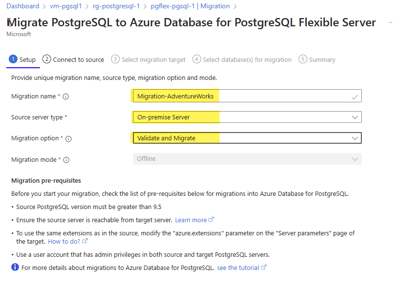

---
lab:
  title: オフライン PostgreSQL データベース移行
  module: Migrate to Azure Database for PostgreSQL Flexible Server
---

# オフライン PostgreSQL データベース移行

この演習では、Azure Database for PostgreSQL フレキシブル サーバーを作成し、Azure Database for PostgreSQL フレキシブル サーバー内の移行機能を使用して、オンプレミスの PostgreSQL サーバーまたは Azure Database for PostgreSQL サーバーからオフライン データベースの移行を実行します。

## 開始する前に

この演習を完了するには、自分の Azure サブスクリプションが必要です。 Azure サブスクリプションをお持ちでない場合は、[Azure 無料試用版](https://azure.microsoft.com/free)を作成できます。

### Azure からの接続を許可するように pg_hba.conf ファイルを編集する (外部 PostgreSQL サーバーから移行しない場合はスキップ)

> [!NOTE]
> このラボでは、移行のソースと移行先として使用する 2 つの Azure Database for PostgreSQL を作成します。 ただし、独自の環境を使用している場合、この演習を完了するには、データベース、適切なアクセス許可、ネットワーク アクセス権を備えた既存の PostgreSQL サーバーにアクセスする必要があります。
> 
> 独自の環境を使用する場合、この演習では、移行のソースとして使用するサーバーが Azure Database for PostgreSQL フレキシブル サーバーにアクセス可能であり、データベースに接続して移行できるような環境を構築しておく必要があります。 このためには、ソース サーバーがパブリック IP アドレスおよびポートを介してアクセスできる必要があります。 Azure リージョンの IP アドレスの一覧を「[Azure IP Ranges and Service Tags – Public Cloud](https://www.microsoft.com/en-gb/download/details.aspx?id=56519)」からダウンロードすることで、使用する Azure リージョンに基づいてファイアウォール規則で許可される IP アドレスの範囲を最小限に抑えることができます。 サーバーのファイアウォールを開いて、Azure Database for PostgreSQL フレキシブル サーバー内の移行機能によるソース PostgreSQL サーバー (既定で TCP ポート **5432**) へのアクセスを許可してください。
>
> ソース データベースの前でファイアウォール アプライアンスを使用している場合は、Azure Database for PostgreSQL フレキシブル サーバー内の機能が移行のためにソース データベースにアクセスすることを許可するファイアウォール規則を追加することが必要な場合があります。
>
> 移行がサポートされている PostgreSQL の最大バージョンはバージョン 16 です。

インスタンスが Azure Database for PostgreSQL フレキシブル サーバーからの接続を許可するように、ソース PostgreSQL サーバーで pg_hba.conf ファイルを更新する必要があります。

1. pg_hba.conf にエントリを追加して、Azure IP 範囲からの接続を許可します。 pg_hba.conf のエントリによって、接続できるホスト、データベース、ユーザー、使用できる認証方法が決まります。
1. たとえば、Azure サービスが IP 範囲 104.45.0.0/16 の範囲内にあるとします。 すべてのユーザーがパスワード認証を使用してこの範囲のすべてのデータベースに接続できるようにするには、次のように追加します。

``` bash
host    all    all    104.45.0.0/16    md5
```

1. Azure からの接続を含むインターネット経由の接続を許可する場合は、強力な認証メカニズムが設定されていることを確認します

- 強力なパスワードを使用します。
- アクセスを許可する IP アドレスを最小限に制限する
- VPN または VNet を使用する: 可能であれば、Azure と PostgreSQL サーバーの間にセキュリティで保護されたトンネルを構築するように、仮想プライベート ネットワーク (VPN) または Azure Virtual Network (VNet) を構成します。

1. pg_hba.conf への変更を保存した後、変更を有効にするには、psql セッション内で SQL コマンドを使用して PostgreSQL 構成を再度読み込む必要があります。

```sql
SELECT pg_reload_conf();
```

1. Azure からローカル PostgreSQL サーバーへの接続をテストして、構成が期待どおりに動作することを確認します。 これは、Azure VM または送信データベース接続をサポートするサービスから実行できます。

### Azure サブスクリプションにリソースをデプロイする

この手順では、Azure Cloud Shell の Azure CLI コマンドにより、リソース グループを作成し、Bicep スクリプトを実行して、この演習を完了するのに必要な Azure サービスを Azure サブスクリプションにデプロイします。

1. Web ブラウザーを開いて [Azure portal](https://portal.azure.com/) に移動します。

1. Azure portal ツール バーの **[Cloud Shell]** アイコンを選択して、ブラウザー画面の下部に新しい [Cloud Shell](https://learn.microsoft.com/azure/cloud-shell/overview) 画面を開きます。

    ![[Cloud Shell] アイコンが赤の四角で強調表示された Azure portal のスクリーンショット。](media/11-portal-toolbar-cloud-shell.png)

    メッセージが表示されたら、必要なオプションを選択して *Bash* シェルを開きます。 以前に *PowerShell* コンソールを使用している場合は、*Bash* シェルに切り替えます。

1. Cloud Shell プロンプトで、次のように入力して、演習リソースを含む GitHub リポジトリを複製します。

    ```bash
    git clone https://github.com/MicrosoftLearning/mslearn-postgresql.git
    ```

1. 次に、Azure CLI コマンドを使用して Azure リソースを作成するときに、冗長な型指定を減らすための変数を定義する 3 つのコマンドを実行します。 この変数は、リソース グループに割り当てる名前 (`RG_NAME`)、リソースがデプロイされる Azure リージョン (`REGION`)、PostgreSQL 管理者ログイン用にランダムに生成されたパスワード (`ADMIN_PASSWORD`) を表します。

    最初のコマンドで、対応する変数に割り当てられるリージョンは `eastus` ですが、任意の場所に置き換えることもできます。

    ```bash
    REGION=eastus
    ```

    次のコマンドで、この演習で使用されるすべてのリソースを格納するリソース グループに使用する名前が割り当てられます。 対応する変数に割り当てられたリソース グループ名は `rg-learn-work-with-postgresql-$REGION` で、その中の `$REGION` は上で指定した場所です。 ただし、この部分は好みに合わせて他のリソース グループ名に変更できます。

    ```bash
    RG_NAME=rg-learn-work-with-postgresql-$REGION
    ```

    最後のコマンドでは、PostgreSQL 管理者ログイン用のパスワードがランダムに生成されます。 後で PostgreSQL フレキシブル サーバーに接続するのに使用するために、このパスワードを必ず安全な場所にコピーしてください。

    ```bash
    a=()
    for i in {a..z} {A..Z} {0..9}; 
       do
       a[$RANDOM]=$i
    done
    ADMIN_PASSWORD=$(IFS=; echo "${a[*]::18}")
    echo "Your randomly generated PostgreSQL admin user's password is:"
    echo $ADMIN_PASSWORD
    ```

1. 複数の Azure サブスクリプションにアクセスでき、既定のサブスクリプションがこの演習でリソース グループとその他のリソースを作成するものでない場合は、次のコマンドを実行して適切なサブスクリプションを設定し、`<subscriptionName|subscriptionId>` トークンを使用するサブスクリプションの名前または ID に置き換えます。

    ```azurecli
    az account set --subscription <subscriptionName|subscriptionId>
    ```

1. 次の Azure CLI コマンドを実行して、リソース グループを作成します。

    ```azurecli
    az group create --name $RG_NAME --location $REGION
    ```

1. 最後に、Azure CLI を使用して Bicep デプロイ スクリプトを実行し、リソース グループ内の Azure リソースをプロビジョニングします。

    ```azurecli
    az deployment group create --resource-group $RG_NAME --template-file "mslearn-postgresql/Allfiles/Labs/Shared/deploy-postgresql-server-migration.bicep" --parameters adminLogin=pgAdmin adminLoginPassword=$ADMIN_PASSWORD databaseName=adventureworks
    ```

    Bicep デプロイ スクリプトでは、この演習を完了するのに必要な Azure サービスがリソース グループにプロビジョニングされます。 デプロイされるリソースは、2 つの Azure Database for PostgreSQL - フレキシブル サーバーです。 これは、移行のソース サーバーと宛先サーバーです。

    通常、デプロイの完了には数分 (5 から 10 分以上) かかります。 Cloud Shell から監視するか、上で作成したリソース グループの **[デプロイ]** ページに移動し、そこでデプロイの進行状況を確認することができます。

1. リソースのデプロイが完了したら、Cloud Shell 画面を閉じます。

1. Azure portal で、2 つの新しい Azure Database for PostgreSQL サーバーの名前を確認します。 ソース サーバーのデータベースを一覧表示すると、**adventureworks** データベースはそこにありますが、移行先サーバーの方にはないことに注意してください。

1. *両方*のサーバーの **[ネットワーク]** セクションで、
    1. **[+ 現在の IP アドレス (xxx.xxx.xxx) を追加する]**、**[保存]** の順に選択します。
    1. **[Azure 内の任意の Azure サービスにこのサーバーへのパブリック アクセスを許可する]** チェックボックスをオンにします。
    1. **[パブリック IP アドレスを使用したインターネット経由でのこのリソースへのパブリック アクセスを許可する]** チェック ボックスをオンにします。

> [!NOTE]
> 運用環境では、Azure Database for PostgreSQL サーバーにアクセスする必要があるオプション、ネットワーク、IP のみを選択する必要があります。 

> [!NOTE]
> 前述のように、この Bicep スクリプトでは、ソースと移行先の 2 つの Azure Database for PostgreSQL サーバーが作成されます。  ***環境内のオンプレミス PostgreSQL サーバーをこのラボのソース サーバーとして使用している場合は、次のすべての手順のソース サーバー接続情報を、環境内のオンプレミス サーバーの接続情報に置き換えてください***。  必ず環境と Azure の両方で、必要なファイアウォール規則を有効にしてください。
    
### デプロイ エラーのトラブルシューティング

Bicep デプロイ スクリプトを実行すると、いくつかエラーが発生する場合があります。 最も一般的なメッセージとその解決手順は次のとおりです。

- 以前にこのラーニング パスで Bicep デプロイ スクリプトを実行してその後リソースを削除した場合、リソースを削除してから 48 時間以内にスクリプトをまた実行しようとすると、次のようなエラー メッセージが表示される場合があります。

    ```bash
    {"code": "InvalidTemplateDeployment", "message": "The template deployment 'deploy' is not valid according to the validation procedure. The tracking id is '4e87a33d-a0ac-4aec-88d8-177b04c1d752'. See inner errors for details."}
    
    Inner Errors:
    {"code": "FlagMustBeSetForRestore", "message": "An existing resource with ID '/subscriptions/{subscriptionId}/resourceGroups/rg-learn-postgresql-ai-eastus/providers/Microsoft.CognitiveServices/accounts/{accountName}' has been soft-deleted. To restore the resource, you must specify 'restore' to be 'true' in the property. If you don't want to restore existing resource, please purge it first."}
    ```

    このメッセージが表示された場合は、`restore` パラメーターが `true` に設定されるように上記の `azure deployment group create` コマンドを変更し、再実行します。

- 選択したリージョンで特定のリソースのプロビジョニングが制限されている場合は、`REGION` 変数を別の場所に設定してコマンドを再実行し、リソース グループを作成して、Bicep デプロイ スクリプトを実行する必要があります。

    ```bash
    {"status":"Failed","error":{"code":"DeploymentFailed","target":"/subscriptions/{subscriptionId}/resourceGroups/{resourceGrouName}/providers/Microsoft.Resources/deployments/{deploymentName}","message":"At least one resource deployment operation failed. Please list deployment operations for details. Please see https://aka.ms/arm-deployment-operations for usage details.","details":[{"code":"ResourceDeploymentFailure","target":"/subscriptions/{subscriptionId}/resourceGroups/{resourceGrouName}/providers/Microsoft.DBforPostgreSQL/flexibleServers/{serverName}","message":"The resource write operation failed to complete successfully, because it reached terminal provisioning state 'Failed'.","details":[{"code":"RegionIsOfferRestricted","message":"Subscriptions are restricted from provisioning in this region. Please choose a different region. For exceptions to this rule please open a support request with Issue type of 'Service and subscription limits'. See https://review.learn.microsoft.com/en-us/azure/postgresql/flexible-server/how-to-request-quota-increase for more details."}]}]}}
    ```

- 責任ある AI 契約に同意する必要があるためにスクリプトで AI リソースを作成できない場合は、次のエラーが発生する場合があります。その場合は、Azure portal ユーザー インターフェイスを使用して Azure AI サービス リソースを作成し、デプロイ スクリプトを再実行します。

    ```bash
    {"code": "InvalidTemplateDeployment", "message": "The template deployment 'deploy' is not valid according to the validation procedure. The tracking id is 'f8412edb-6386-4192-a22f-43557a51ea5f'. See inner errors for details."}
     
    Inner Errors:
    {"code": "ResourceKindRequireAcceptTerms", "message": "This subscription cannot create TextAnalytics until you agree to Responsible AI terms for this resource. You can agree to Responsible AI terms by creating a resource through the Azure Portal then trying again. For more detail go to https://go.microsoft.com/fwlink/?linkid=2164190"}
    ```

## 移行用のデータベース、テーブル、データを作成する

このラボでは、オンプレミスの PostreSQL サーバーから移行するか、Azure Database for PostgreSQL サーバーから移行するかを選択できます。 移行元のサーバーの種類に対する手順に従ってください。

### オンプレミスの PostgreSQL サーバーにデータベースを作成する (Azure Database for PostgreSQL サーバーから移行する場合はスキップしてください)

これから、Azure Database for PostgreSQL フレキシブル サーバーに移行するデータベースを設定する必要があります。 この手順はソース PostgreSQL サーバー インスタンスですべて行う必要があり、このラボを完了するには、このインスタンスが Azure Database for PostgreSQL フレキシブル サーバーからアクセスできる必要があります。

まず、空のデータベースを作成する必要があります。このデータベースは、後にテーブルを作成してデータと共に読み込みます。 まず第一に、[リポジトリ](https://github.com/MicrosoftLearning/mslearn-postgresql/tree/main/Allfiles/Labs/10)からローカル ドライブ (**C:\\** など) に ***Lab10_setupTable.sql*** ファイルと ***Lab10_workorder.csv*** ファイルをダウンロードする必要があります。
これらのファイルを用意したら、次のコマンドを使用してデータベースを作成できます。**ホスト、ポート、およびユーザー名の値は、必要に応じて PostgreSQL サーバー用に置き換えてください。**

```bash
psql --host=localhost --port=5432 --username=pgadmin --command="CREATE DATABASE adventureworks;"
```

次のコマンドを実行して、データを読み込むための `production.workorder` テーブルを作成します。

```sql
    DROP SCHEMA IF EXISTS production CASCADE;
    CREATE SCHEMA production;
    
    DROP TABLE IF EXISTS production.workorder;
    CREATE TABLE production.workorder
    (
        workorderid integer NOT NULL,
        productid integer NOT NULL,
        orderqty integer NOT NULL,
        scrappedqty smallint NOT NULL,
        startdate timestamp without time zone NOT NULL,
        enddate timestamp without time zone,
        duedate timestamp without time zone NOT NULL,
        scrapreasonid smallint,
        modifieddate timestamp without time zone NOT NULL DEFAULT now()
    )
    WITH (
        OIDS = FALSE
    )
    TABLESPACE pg_default;
    ALTER TABLE production.workorder OWNER to pgAdmin;
```

```sql
psql --host=localhost --port=5432 --username=postgres --dbname=adventureworks --command="\COPY production.workorder FROM 'C:\Lab10_workorder.csv' CSV HEADER"
```

コマンド出力は、CSV ファイルから 72101 行がテーブルに書き込まれたことを示す `COPY 72101` となるはずです。

## 移行前 (Azure Database for PostgreSQL サーバーからの移行の場合はスキップしてください)

ソース サーバーからのデータベースのオフライン移行を開始する前に、ターゲット サーバーが構成済みで、準備ができていることを確認する必要があります。

1. ソース サーバーから新しいフレキシブル サーバーにユーザーとロールを移行します。 これは、pg_dumpall ツールを使用して次のコードで実行できます。
    1. スーパーユーザー ロールは Azure Database for PostgreSQL ではサポートされていないため、この特権を持つすべてのユーザーは、移行前に削除する必要があります。

```bash
pg_dumpall --globals-only -U <<username>> -f <<filename>>.sql
```

1. ターゲット サーバー上のソース サーバーのサーバー パラメーター値と照合します。
1. ターゲットで高可用性と読み取りレプリカを無効にします。

### Azure Database for PostgreSQL サーバーにデータベースを作成する (オンプレミスの PostgreSQL サーバーから移行する場合はスキップしてください)

これから、Azure Database for PostgreSQL フレキシブル サーバーに移行するデータベースを設定する必要があります。 この手順はソース PostgreSQL サーバー インスタンスですべて行う必要があり、このラボを完了するには、このインスタンスが Azure Database for PostgreSQL フレキシブル サーバーからアクセスできる必要があります。

まず、空のデータベースを作成する必要があります。このデータベースは、後にテーブルを作成してデータと共に読み込みます。 

1. [Azure portal](https://portal.azure.com/) で、新しく作成されたソース Azure Database for PostgreSQL サーバー (_**psql-learn-source**_-location-uniquevalue) に移動します。

1. リソース メニューの **[設定]** で、**[データベース]** を選択し、`adventureworks` データベースの **[接続]** を選択します。

    ![Azure Database for PostgreSQL の [データベース] ページのスクリーンショット。 adventureworks データベースの [データベース] と [接続] は赤いボックスで強調表示されています。](media/08-postgresql-adventureworks-database-connect.png)

1. Cloud Shell の "ユーザー pgAdmin のパスワード" というプロンプトで、**pgAdmin** のログイン用にランダムに生成されたパスワードを入力します。

    ログインすると、`adventureworks` データベースの `psql` プロンプトが表示されます。

1. 次のコマンドを実行して、データを読み込むための `production.workorder` テーブルを作成します。

    ```sql
        DROP SCHEMA IF EXISTS production CASCADE;
        CREATE SCHEMA production;
        
        DROP TABLE IF EXISTS production.workorder;
        CREATE TABLE production.workorder
        (
            workorderid integer NOT NULL,
            productid integer NOT NULL,
            orderqty integer NOT NULL,
            scrappedqty smallint NOT NULL,
            startdate timestamp without time zone NOT NULL,
            enddate timestamp without time zone,
            duedate timestamp without time zone NOT NULL,
            scrapreasonid smallint,
            modifieddate timestamp without time zone NOT NULL DEFAULT now()
        )
        WITH (
            OIDS = FALSE
        )
        TABLESPACE pg_default;
    ```

    ```sql
    \COPY production.workorder FROM 'mslearn-postgresql/Allfiles/Labs/10/Lab10_workorder.csv' CSV HEADER
    ```

    コマンド出力は、CSV ファイルから 72101 行がテーブルに書き込まれたことを示す `COPY 72101` となるはずです。

1. **Cloud Shell**を閉じます。

## Azure Database for PostgreSQL フレキシブル サーバーでデータベース移行プロジェクトを作成する

1. 移行先サーバーで、フレキシブル サーバー ブレードの左側にあるメニューから **[移行]** を選択します。

   

1. **[移行]** ブレードの上部にある **[+ 作成]** オプションをクリックします。
   > **注**: **[+ 作成]** オプションが使用できない場合は、**[コンピューティングとストレージ]** を選択し、コンピューティング レベルを **[汎用]** か **[メモリ最適化]** のどちらかに変更して、移行プロセスの作成をもう一度試してみます。 移行が成功したら、コンピューティング レベルを**バースト可能**に戻すことができます。
1. **[セットアップ]** タブで、各フィールドに次のように入力します。
    1. 移行の名前 - **`Migration-AdventureWorks`**。
    1. ソース サーバーの種類: このラボでは、オンプレミスから移行する場合でも、Azure Database for PostgreSQL から移行する場合でも、**[オンプレミス サーバー]** を選択します。 運用環境では、正しいソース サーバーの種類を選択します。
    1. 移行オプション - **検証と移行**。
    1. 移行モード - **オフライン**。 
    1. **[次へ: ランタイム サーバーの選択]** を選択します。
    1. *[ランタイム サーバーを使用する]* には、**[いいえ]** を選択します。
    1. **[ソースに接続]** を選択します。

    

1. Azure Database for PostgreSQL からの移行の場合- **[ソースに接続]** タブで、各フィールドに次のように入力します。
    1. サーバー名 - ソースとして使用しているサーバーのアドレス。
    1. ポート - ソース サーバー上で PostgreSQL のインスタンスが使用するポート (既定値は 5432)。
    1. サーバー管理者ログイン名 - PostgreSQL インスタンスの管理者ユーザーの名前 (既定値は pgAdmin)。
    1. パスワード - 前の手順で指定した PostgreSQL 管理者ユーザーのパスワード。
    1. SSL モード - [優先]。
    1. **[ソースに接続]** オプションをクリックして、指定された接続詳細を検証します。
    1. **[次へ: 移行ターゲットの選択]** ボタンをクリックして続行します。

1. 移行先となるターゲット サーバーの接続の詳細がすべて自動的に入力されます。
    1. [パスワード] フィールドに、bicep スクリプトで作成した **pgAdmin** ログインのランダムに生成されたパスワードを入力します。
    1. **[ターゲットに接続]** オプションをクリックして、指定された接続詳細を検証します。
    1. **[次へ: 移行するデータベースの選択]** ボタンをクリックして続行します。
1. **[移行するデータベースの選択]** タブで、フレキシブル サーバーに移行するソース サーバーから **adventureworks** を選択します。

    

1. **[次へ: 概要]** ボタンをクリックして続行し、指定されたデータを確認します。
1. **[概要]** タブで情報を確認したあと、**[検証と移行の開始]** ボタンをクリックして、フレキシブル サーバーへの移行を開始します。
1. **[移行]** タブでは、上部メニューの **[更新]** ボタンを使用して検証と移行の進行状況を表示することで、移行の進行状況を監視できます。
    1. **[移行-AdventureWorks]** アクティビティをクリックすると、移行アクティビティの進行状況に関する詳細情報が表示されます。
1. 移行が完了したら、移行先サーバーを確認します。これで、**adventureworks** データベースもそのサーバー下の一覧に表示されます。

移行プロセスが完了したら、新しいデータベースでのデータ検証や高可用性の構成などの移行後のタスクを実行してから、アプリケーションのデータベースをポイントして、再度有効にすることができます。

## 演習のクリーンアップ

この演習でデプロイした Azure Database for PostgreSQL は、次の演習で使用します。 料金が発生するので、この演習の後にサーバーを停止できます。 または、**rg-learn-work-with-postgresql-eastus** リソース グループを削除して、この演習の一環としてデプロイしたすべてのリソースを削除することもできます。 つまり、次の演習を完了するには、この演習の手順を繰り返す必要があります。
